# RE:TRACE

## Integrated Secure Data Erasure + Advanced File Recovery

<p align="center">
  <strong>Recover what matters. Erase what must never return. Verify both with trusted proof.</strong>
</p>

<p align="center">
  Smart India Hackathon 2026 · Problem Statement SIH26149 · Team Cryptic Crew
</p>

<p align="center">

[](https://re-trace-phi.vercel.app/)


</p>

---

> **RE:TRACE is a case-based secure media assurance platform that combines forensic file recovery, controlled data sanitization, independent post-erasure validation, activity provenance, tamper-evident auditing, and structured forensic reporting within one workflow.**

Most existing tools focus primarily on one side of the lifecycle:

```text
Recover Data
     OR
Erase Data
```

RE:TRACE connects both sides and adds another important layer:

```text
RECOVER
   +
ERASE
   +
VERIFY
   +
TRACE
   +
REPORT
```

The goal is not simply to perform an operation.

The goal is to make that operation **traceable, verifiable, reviewable, and connected to an investigation case**.

---

# Live Prototype

### [Open RE:TRACE](https://re-trace-phi.vercel.app/)

The hosted prototype demonstrates the RE:TRACE investigation workflow in a controlled environment.

> **Safety Boundary:** The deployed web prototype does not issue destructive ATA, NVMe, or physical-drive commands against a visitor's hardware. Sanitization is demonstrated using uploaded data, generated forensic media, and disposable working copies.

---

# Problem Statement

Digital investigations often require two apparently opposite capabilities:

- recovering deleted information when evidence must be preserved;
- securely sanitizing sensitive information when it must not remain recoverable.

These workflows are commonly handled using different utilities.

That separation creates additional challenges around:

- evidence context;
- operation tracking;
- validation;
- accountability;
- post-erasure assurance;
- integrity checking;
- timeline reconstruction;
- forensic reporting.

RE:TRACE approaches the problem as a single **Secure Media Assurance Lifecycle**.

```text
Evidence Source
      │
      ▼
Register & Fingerprint
      │
      ▼
Choose Operation
      │
      ├───────────────┐
      ▼               ▼
   Recover         Sanitize
      │               │
      ▼               ▼
   Validate        Verify
      │               │
      └───────┬───────┘
              ▼
        Recovery Challenge
              │
              ▼
       Activity Provenance
              │
              ▼
       Tamper-Evident Audit
              │
              ▼
       Forensic Reporting
```

---

# Why RE:TRACE?

RE:TRACE is designed around five questions:

1. **Can deleted evidence still be recovered?**
2. **Can sensitive data be sanitized in a controlled workflow?**
3. **Can the sanitization result be independently challenged?**
4. **Can we determine who performed each important action and when?**
5. **Can the complete operation become a verifiable forensic record?**

The platform combines these concerns instead of treating them as independent utilities.

---

# System Architecture

RE:TRACE follows a layered architecture separating the user interface, application services, forensic processing engines, assurance logic, persistence, and reporting components.

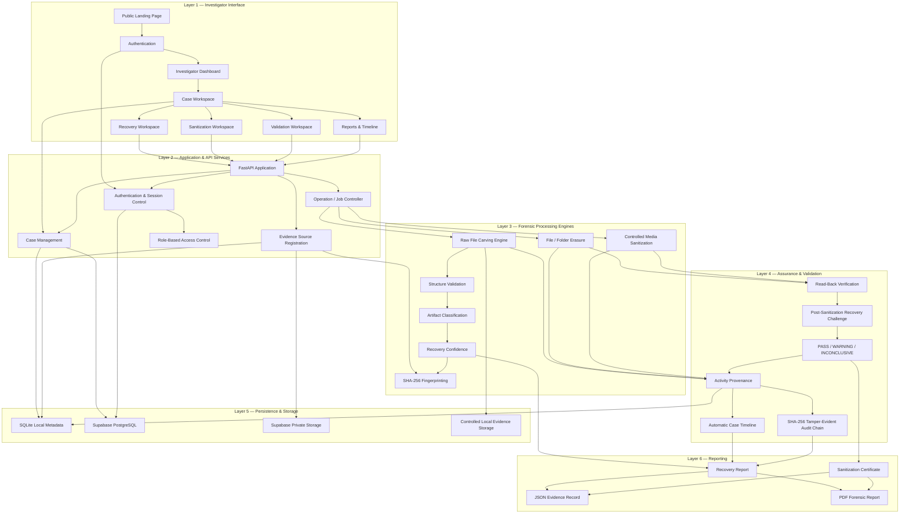

---

# Architecture Layers

## Layer 1 — Investigator Interface

The frontend provides a unified investigation workspace for:

- authentication;
- dashboard navigation;
- case creation;
- evidence registration;
- recovery;
- sanitization;
- validation;
- case timeline inspection;
- audit verification;
- report generation.

The interface is built using:

- React;
- TypeScript;
- Vite.

---

## Layer 2 — Application & API Services

The API layer coordinates actions between the interface and processing engines.

It is responsible for:

```text
Authentication
     +
Session Management
     +
Case Management
     +
Evidence Registration
     +
Operation Control
     +
Access Authorization
```

The local API is implemented using **FastAPI**.

---

## Layer 3 — Forensic Processing Engines

The forensic processing layer performs the main technical operations.

It contains:

- source hashing;
- raw byte scanning;
- signature detection;
- candidate extraction;
- file structure validation;
- artifact classification;
- recovery confidence analysis;
- controlled sanitization;
- file/folder erasure;
- verification support.

---

## Layer 4 — Assurance & Validation

This layer differentiates RE:TRACE from a simple erase or recovery utility.

After an operation, the platform records and checks what happened.

The assurance layer includes:

- read-back verification;
- recovery challenge after sanitization;
- validation outcomes;
- activity provenance;
- timeline construction;
- tamper-evident audit chaining.

---

## Layer 5 — Persistence & Storage

RE:TRACE supports a hybrid prototype storage architecture.

| Component | Purpose |
|---|---|
| SQLite | Local application and forensic metadata |
| Supabase PostgreSQL | Cloud metadata persistence |
| Supabase Storage | Private controlled object storage |
| Local Filesystem | Recovery outputs and controlled forensic data |

---

## Layer 6 — Reporting

Investigation results are converted into structured outputs.

Current output types include:

- forensic recovery reports;
- sanitization certificates;
- activity timeline;
- evidence hashes;
- audit integrity information;
- PDF exports;
- JSON exports.

---

# Core Processing Pipelines

## 1. Evidence Intake & Registration Pipeline

Every forensic operation starts with identifying the source and associating it with a case.

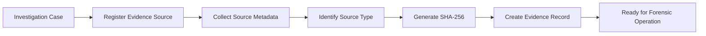

Typical source metadata can include:

```text
Source Name
Source Type
Media Profile
File / Image Size
Filesystem Information
SHA-256
Case Association
```

---

# 2. File Carving & Recovery Pipeline

RE:TRACE performs signature-based carving against raw forensic/test images.


The current prototype focuses on:

| Category | Supported Format |
|---|---|
| Image | JPEG |
| Image | PNG |
| Document | PDF |
| Archive | ZIP |

---

# 3. Explainable Recovery Confidence Pipeline

Finding a file header alone does not guarantee that the recovered object is valid.

RE:TRACE therefore performs additional checks.

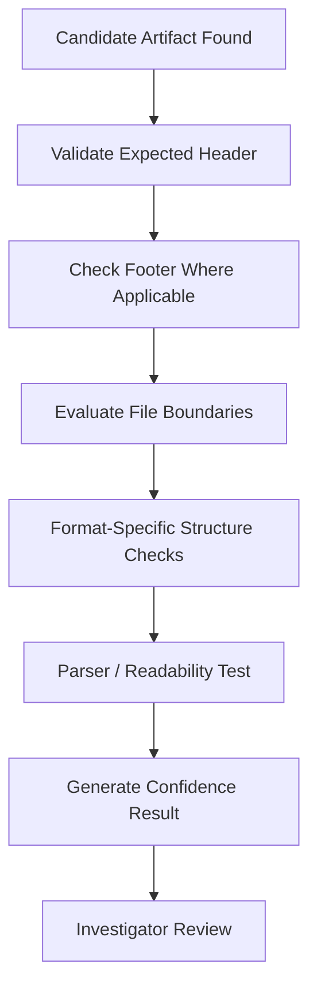

Checks can include:

- expected headers;
- expected footers where applicable;
- structural validity;
- file boundary plausibility;
- parser/readability checks;
- format consistency.

This provides additional context to the investigator instead of presenting every carved object as equally reliable.

---

# 4. Smart Sanitization Policy Pipeline

Storage technologies cannot always be treated identically.

RE:TRACE therefore separates policy selection from the destructive operation.

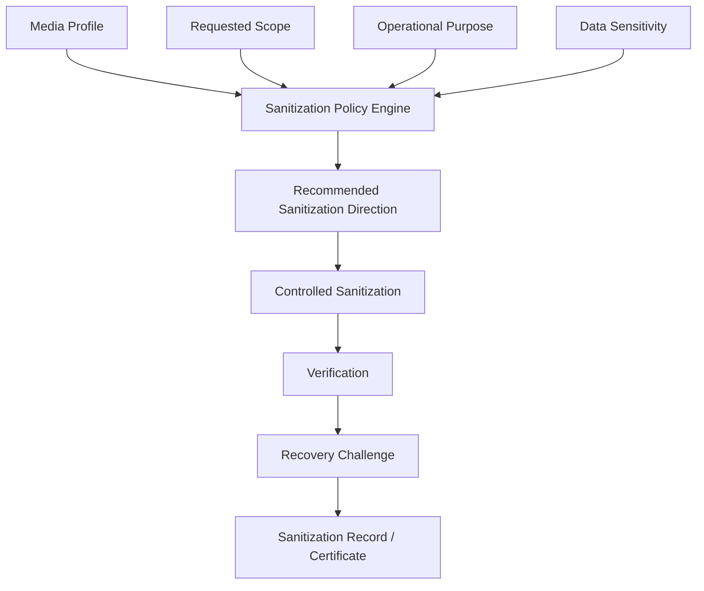

### Media-Aware Direction

| Media Type | RE:TRACE Direction |
|---|---|
| HDD | Overwrite-oriented sanitization workflow |
| SSD | Secure erase / cryptographic erase where supported |
| NVMe | NVMe sanitize / secure format where supported |
| USB Flash | Logical sanitization with flash-storage limitations |
| File / Folder | Controlled selective erasure |

> In the hosted prototype, these choices are demonstrated safely using working copies rather than issuing direct commands to physical storage devices.

---

# 5. Secure File & Folder Erasure Pipeline

RE:TRACE supports controlled erasure for:

- individual files;
- multiple files;
- folders;
- batch targets.

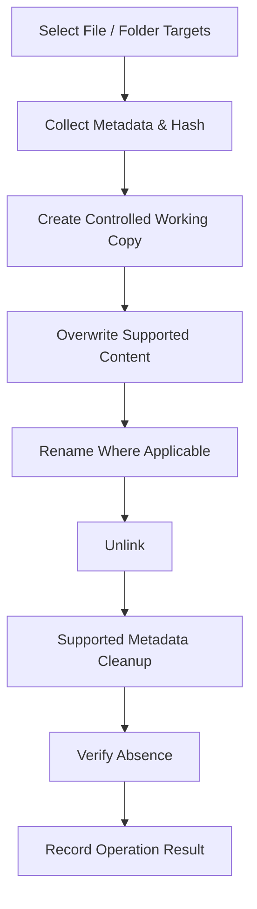

---

# 6. Independent Sanitization Validation

A successful erase command should not automatically be interpreted as proof that nothing remains recoverable.

RE:TRACE introduces an independent post-sanitization challenge.

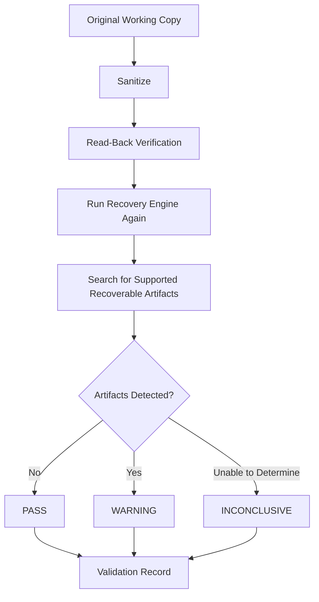

### Validation Results

| Result | Meaning |
|---|---|
| **PASS** | No supported recoverable artifacts were detected |
| **WARNING** | One or more supported artifacts remain recoverable |
| **INCONCLUSIVE** | The validation engine could not determine the result reliably |

> A PASS means the supported validation checks found no recoverable supported artifacts. It is not presented as proof of absolute physical irrecoverability.

---

# 7. Activity Provenance Pipeline

Important actions are recorded with investigation context.

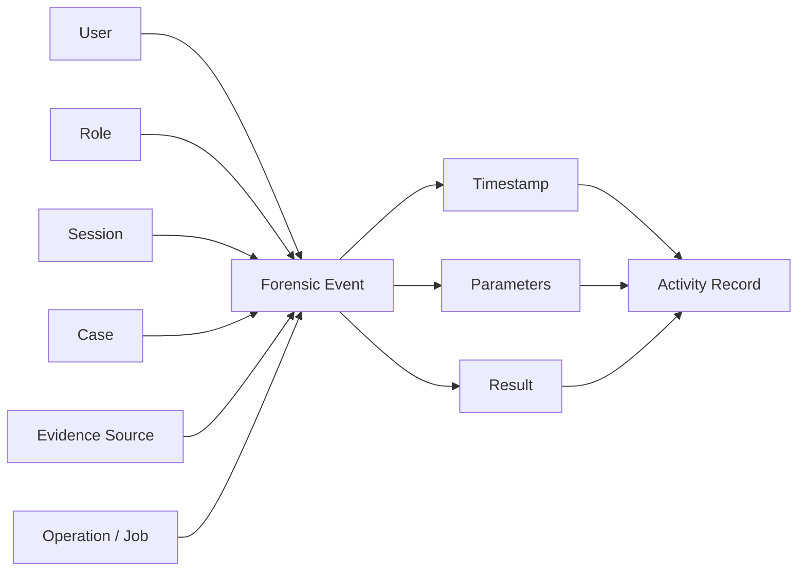

Examples of recorded actions include:

- authentication;
- case creation;
- source registration;
- evidence hashing;
- recovery started;
- recovery completed;
- artifact recovered;
- sanitization started;
- sanitization completed;
- verification performed;
- validation performed;
- report generated;
- evidence exported.

---

# 8. Automatic Timeline Construction

Activity provenance is used to build the case timeline automatically.

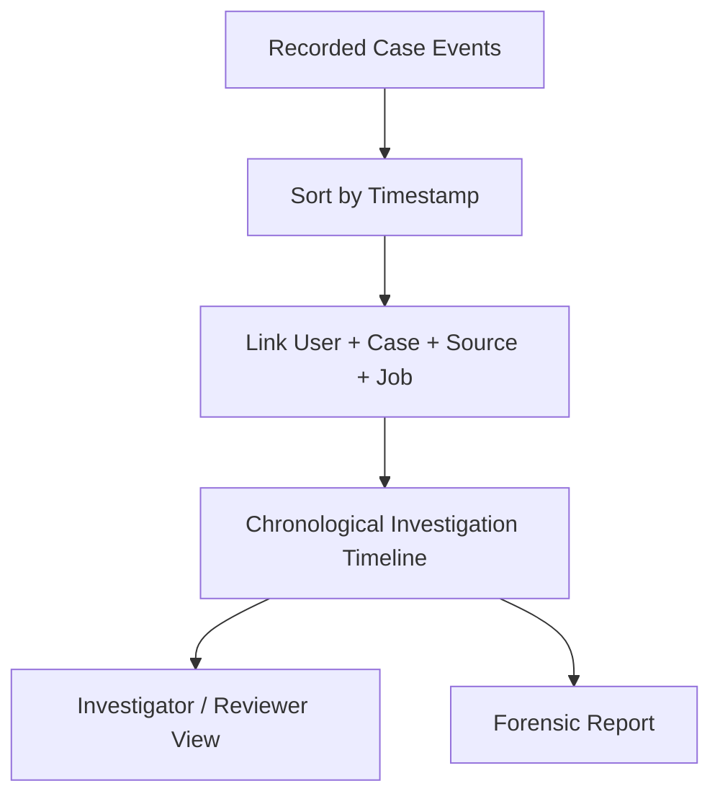

Example timeline:

```text
09:31:08  Investigator authenticated
09:31:19  CASE-001 opened
09:32:05  Disk image registered
09:32:06  SHA-256 generated
09:33:14  Recovery started
09:37:41  Artifact recovery completed
09:38:12  Evidence hashes generated
09:39:02  Forensic report generated
```

This removes the need to reconstruct the investigation sequence manually from unrelated logs.

---

# 9. Tamper-Evident Audit Architecture

Ordinary logs can be modified without necessarily exposing the change.

RE:TRACE links audit events through SHA-256 hashes.

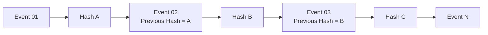

During integrity validation:

```text
Stored Event
     │
     ▼
Recalculate Hash
     │
     ▼
Compare Against Stored Hash
     │
     ├── Match ───────► Integrity Preserved
     │
     └── Mismatch ────► Tampering / Modification Detected
```

This provides **tamper evidence** for recorded application activity.

It does not claim absolute immutability against a fully privileged administrator controlling the underlying host or database.

---

# 10. Forensic Reporting Pipeline

All important outputs converge into a structured report.

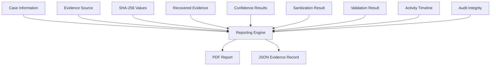

Reports can contain:

- Case ID
- Investigator
- Evidence source
- Source fingerprint
- Operation details
- Recovered evidence
- Confidence information
- Sanitization method
- Verification outcome
- Recovery challenge result
- Timeline
- Audit-chain status

---

# Key Features

## 1. Case-Based Investigation Workspace

Every important operation belongs to a case.

A case can contain:

```text
Case ID
Title
Description
Department
Investigator
Priority
Status
Evidence Sources
Operations
Timeline
Reports
```

This prevents evidence, recovery runs, or sanitization events from existing without context.

---

## 2. Raw File Carving

The recovery engine does not depend exclusively on normal filesystem metadata.

Instead, it can inspect raw bytes and identify supported artifacts from known structures and signatures.

Current MVP support:

- JPEG;
- PNG;
- PDF;
- ZIP.

---

## 3. Evidence Integrity

Evidence sources and important outputs can be fingerprinted using **SHA-256**.

Example:

```text
Evidence Source
      ↓
SHA-256
      ↓
Case Evidence Record
      ↓
Operation
      ↓
Output Hash
```

Hashes provide a reproducible integrity reference for later comparison.

---

## 4. Explainable Recovery Confidence

Recovered objects are evaluated using several structural checks rather than blindly accepted after a signature match.

This helps distinguish:

```text
Signature Found
```

from:

```text
Signature Found
      +
Structure Valid
      +
Boundaries Plausible
      +
Parser Check
      ↓
Higher Confidence
```

---

## 5. Media-Aware Sanitization

RE:TRACE separates sanitization decisions by:

- media profile;
- scope;
- operational purpose;
- sensitivity.

This avoids presenting one overwrite method as universally appropriate for every type of modern storage media.

---

## 6. Independent Recovery Challenge

After sanitization, RE:TRACE can reuse the recovery engine against the sanitized working copy.

That creates a closed assurance loop:

```text
SANITIZE
   ↓
VERIFY
   ↓
ATTEMPT RECOVERY
   ↓
ASSESS RESULT
```

---

## 7. Activity Provenance

Every significant operation can be linked to:

```text
WHO
+
WHAT
+
WHEN
+
CASE
+
SOURCE
+
RESULT
```

This makes investigation activity easier to review.

---

## 8. Automatic Case Timeline

Case events become a chronological timeline automatically.

Investigators do not have to manually combine authentication logs, recovery activity, sanitization events, and report-generation events.

---

## 9. Tamper-Evident Audit Trail

Events are chained using SHA-256 so unexpected modification of historical records can be detected during verification.

---

## 10. Structured Forensic Reporting

RE:TRACE can convert investigation data into portable reports.

Supported prototype formats:

- PDF
- JSON

---

# Platform Screens

## Landing Page

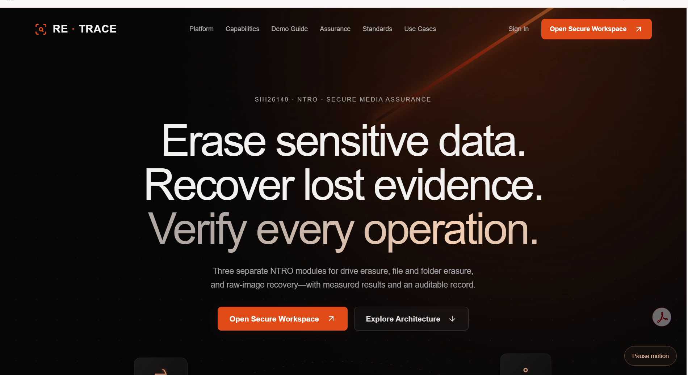

The public landing page introduces:

- the problem;
- RE:TRACE's approach;
- platform capabilities;
- assurance features;
- authentication entry points.

---

## Investigator Dashboard

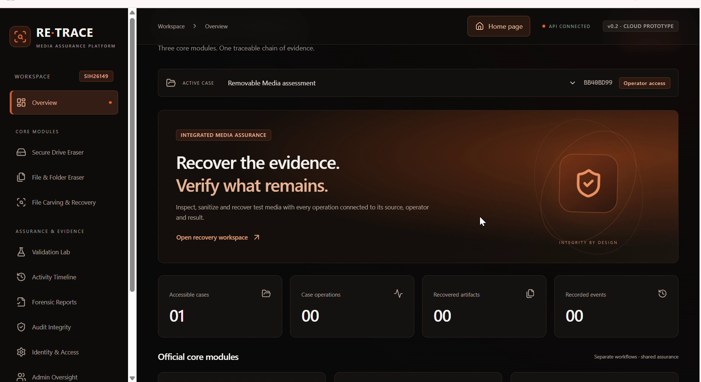

The investigator dashboard provides centralized access to:

- Cases
- Recovery
- Sanitization
- Validation
- Timeline
- Audit Records
- Reports

---

## Secure File & Folder Erasure

### Input

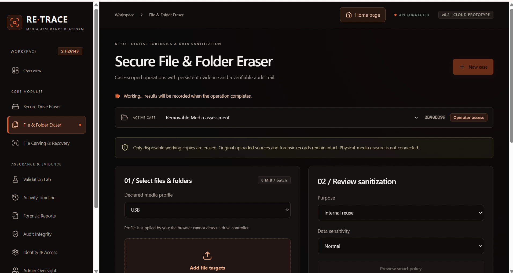

### Result

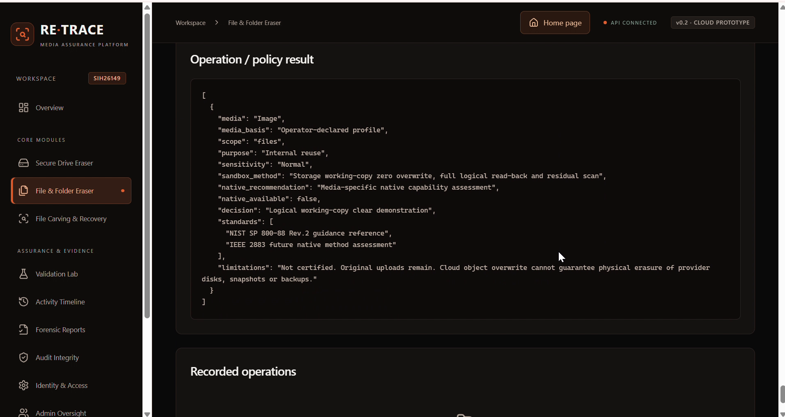

---

## File Carving & Recovery

### Input

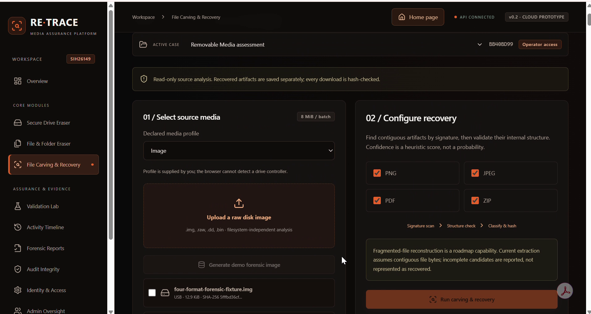

### Recovered Evidence

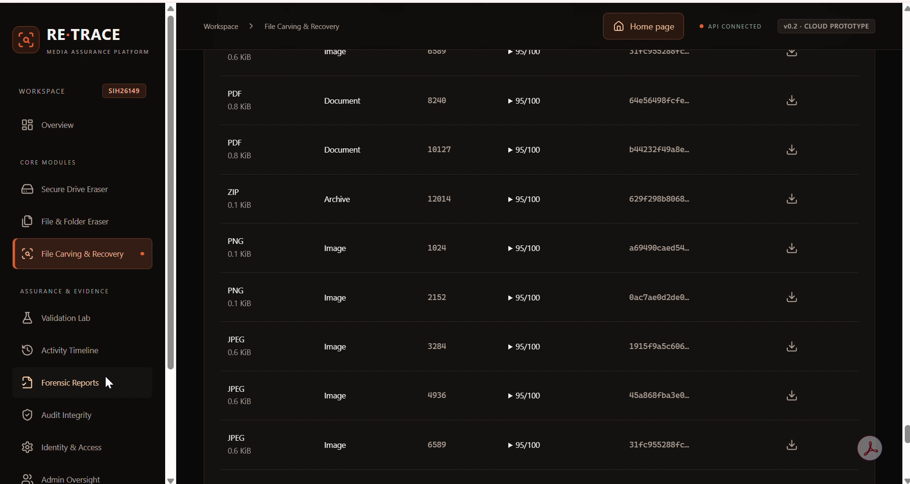

---

## Forensic Report

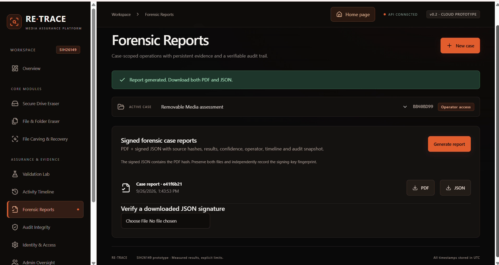

---

# End-to-End Data Flow

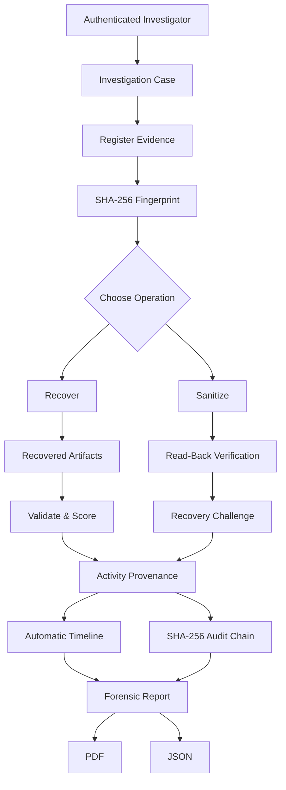

---

# Technical Stack

| Layer | Technology | Purpose |
|---|---|---|
| **Frontend** | React | Investigator interface |
| **Frontend Language** | TypeScript | Type-safe UI development |
| **Frontend Tooling** | Vite | Development and production builds |
| **Backend Language** | Python | Core processing logic |
| **API** | FastAPI | Local API and application services |
| **Local Database** | SQLite | Local metadata persistence |
| **Cloud Database** | Supabase PostgreSQL | Cloud metadata storage |
| **Authentication** | Supabase Auth | User authentication |
| **Authorization** | Role-Based Access + Supabase RLS | Access isolation |
| **Object Storage** | Supabase Storage | Private controlled evidence/file storage |
| **Integrity** | SHA-256 | Evidence fingerprinting and audit chaining |
| **Local Storage** | Filesystem | Controlled forensic evidence/output storage |
| **Deployment** | Vercel | Hosted frontend prototype |

---

# Repository Structure

```text
Re-Trace/
│
├── backend/
│   │
│   ├── app/
│   │   ├── auth.py
│   │   ├── engines.py
│   │   ├── main.py
│   │   ├── native_adapter.py
│   │   ├── reports.py
│   │   └── store.py
│   │
│   ├── tests/
│   │
│   ├── requirements.txt
│   ├── .env.example
│   └── .env
│
├── frontend/
│   │
│   ├── src/
│   │
│   ├── public/
│   ├── package.json
│   └── vite.config.*
│
├── docs/
│
├── screenshots/
│   ├── 01-landing-page.png
│   ├── 01-file-folder-eraser-input.png
│   ├── 02-dashboard-overview.png
│   ├── 02-file-folder-eraser-output.png
│   ├── 03-file-carving-recovery-input.png
│   ├── 04-file-carving-recovery-output.png
│   └── 05-forensic-report-generated.png
│
├── scripts/
│
└── README.md
```

---

# Important Source Files

| File | Responsibility |
|---|---|
| `backend/app/auth.py` | Authentication and session handling |
| `backend/app/engines.py` | Recovery, sanitization, validation and demo processing |
| `backend/app/main.py` | FastAPI routes and application control |
| `backend/app/store.py` | Persistence, activity, timeline and audit data |
| `backend/app/reports.py` | PDF / JSON forensic reporting |
| `backend/app/native_adapter.py` | Native/local hardware integration abstraction |
| `frontend/src/` | Investigator workspace and public frontend |

---

# Investigation Workflow

## 1. Authenticate

The investigator signs into RE:TRACE.

```text
Login
  ↓
Authentication
  ↓
Session Created
  ↓
Role Verified
  ↓
Dashboard
```

---

## 2. Create Case

Create a case and enter relevant investigation information.

Example:

```text
Case ID: CASE-001
Title: Removable Media Investigation
Investigator: Assigned User
Priority: High
Status: Active
```

---

## 3. Register Evidence

Select or create an evidence source.

Supported prototype inputs include:

- raw disk images;
- uploaded files;
- folders;
- generated forensic test media.

RE:TRACE generates a SHA-256 fingerprint for the registered source.

---

## 4. Choose Operation

The investigator can choose between the principal workflows:

```text
Evidence
   │
   ├── File Recovery
   │
   ├── File / Folder Erasure
   │
   └── Controlled Media Sanitization
```

---

# Operation Guide

## File Carving & Recovery

1. Authenticate as an investigator.
2. Create or open a case.
3. Register the forensic/test image.
4. Verify the source fingerprint.
5. Open **File Carving & Recovery**.
6. Start the recovery operation.
7. Allow RE:TRACE to scan the raw source.
8. Review detected artifacts.
9. Inspect:
   - type;
   - structure validation;
   - confidence;
   - SHA-256.
10. Export recovered evidence where appropriate.
11. Generate the forensic recovery report.

---

# File & Folder Erasure

1. Open a case.
2. Navigate to the file/folder erasure workspace.
3. Select:
   - a file;
   - multiple files;
   - a folder;
   - a batch of targets.
4. Review target details.
5. Run the controlled sanitization workflow.
6. Review operation results.
7. Verify supported absence checks.
8. Review timeline and audit record.
9. Generate a sanitization record.

---

# Sanitization Validation

After sanitization:

1. RE:TRACE performs supported verification.
2. The sanitized working copy is provided to the recovery engine.
3. The recovery engine searches again for supported artifacts.
4. The validation layer generates:

```text
PASS
WARNING
INCONCLUSIVE
```

5. The validation result becomes part of:
   - the activity timeline;
   - the audit trail;
   - the final report.

---

# Reproducible Demo Dataset

RE:TRACE includes a deterministic forensic fixture for repeatable demonstrations.

| Artifact | Quantity |
|---|---:|
| JPEG | 3 |
| PNG | 2 |
| PDF | 2 |
| ZIP | 1 |
| **Total** | **8** |

Using a known test dataset allows evaluators to compare:

```text
Expected Artifacts
        vs
Recovered Artifacts
```

instead of relying on an unknown input.

---

# SIH Evaluation Demo

A complete RE:TRACE demonstration can follow this sequence.

```mermaid
flowchart LR

    A["1. Login"]
      --> B["2. Create Case"]

    B --> C["3. Register Evidence"]

    C --> D["4. SHA-256"]

    D --> E["5. Recover"]

    E --> F["6. Review Evidence"]

    F --> G["7. Generate Recovery Report"]

    G --> H["8. Sanitize Working Copy"]

    H --> I["9. Verify"]

    I --> J["10. Recovery Challenge"]

    J --> K["11. Review Timeline"]

    K --> L["12. Verify Audit Chain"]

    L --> M["13. Generate Final Report"]
```

### Step 1 — Login

Authenticate as an investigator.

### Step 2 — Create Case

Create a new investigation case.

### Step 3 — Register Evidence

Upload or generate a forensic test image.

### Step 4 — Fingerprint Source

RE:TRACE generates its SHA-256 value.

### Step 5 — Recover Evidence

Run the recovery engine.

Expected fixture formats:

```text
JPEG
PNG
PDF
ZIP
```

### Step 6 — Review Recovery

Inspect:

- classification;
- structure validation;
- confidence;
- source association;
- SHA-256.

### Step 7 — Generate Recovery Report

Export the initial forensic report.

### Step 8 — Sanitize

Use a disposable copy and run the controlled sanitization workflow.

### Step 9 — Verify

Perform supported read-back verification.

### Step 10 — Challenge the Sanitization Result

Run the recovery engine again against the sanitized copy.

Show:

```text
PASS
     or
WARNING
     or
INCONCLUSIVE
```

### Step 11 — Review Timeline

Display all major operations in chronological order.

### Step 12 — Validate Audit Integrity

Verify the SHA-256 event chain.

### Step 13 — Generate Final Report

Generate the sanitization certificate and forensic report.

---

# Security & Forensic Integrity Model

RE:TRACE follows several security principles.

## Evidence Preservation

Recovery operations are designed to work against the forensic/test source without modifying the original source.

```text
Original Source
      ↓
Read-Only Processing
      ↓
Recovered Copy
```

---

## Evidence Fingerprinting

Important evidence sources and outputs can receive SHA-256 fingerprints.

```text
SHA-256(Source)
      =
Evidence Fingerprint
```

A later hash comparison can reveal unexpected modification.

---

## Controlled Destructive Operations

The cloud-hosted prototype does not directly erase visitors' physical storage devices.

Instead:

```text
Original Data
     ↓
Controlled / Disposable Copy
     ↓
Sanitization
     ↓
Verification
```

This allows the workflow to be demonstrated without exposing physical storage devices to unsafe remote operations.

---

## Access Control

The prototype supports role-based access.

| Role | Access |
|---|---|
| **Admin** | Administrative and case-wide access |
| **Investigator** | Case creation and forensic operations |
| **Viewer** | Read-only access to assigned information |

---

## Audit Integrity

Events are connected through SHA-256 hash chaining.

If an earlier record changes, later chain verification can detect the inconsistency.

---

# Standards & Engineering References

RE:TRACE uses recognized technical guidance as engineering references.

| Reference | Use in RE:TRACE |
|---|---|
| **NIST SP 800-88 Rev. 2** | Media sanitization guidance |
| **IEEE 2883** | Sanitization-related engineering reference |
| **Digital Evidence Integrity Principles** | Evidence preservation and verification |
| **Chain-of-Custody Principles** | Case and activity provenance |
| **DoD 5220.22-M** | Legacy/reference overwrite approach |

> RE:TRACE does **not** claim formal NIST, IEEE, government, laboratory, or forensic-product certification.

These references guide the engineering approach rather than representing external certification.

---

# What Is Implemented

| Capability | Status |
|---|---|
| Case-based workflow | ✅ Implemented |
| Authentication | ✅ Implemented |
| Role-based access | ✅ Implemented |
| Evidence registration | ✅ Implemented |
| SHA-256 source hashing | ✅ Implemented |
| Raw image processing | ✅ Implemented |
| JPEG recovery | ✅ Implemented |
| PNG recovery | ✅ Implemented |
| PDF recovery | ✅ Implemented |
| ZIP recovery | ✅ Implemented |
| Structure validation | ✅ Implemented |
| Recovery confidence | ✅ Implemented |
| Secure working-copy erasure | ✅ Implemented |
| File/folder batch erasure | ✅ Implemented |
| Independent sanitization validation | ✅ Implemented |
| Activity provenance | ✅ Implemented |
| Automatic case timeline | ✅ Implemented |
| SHA-256 audit chain | ✅ Implemented |
| PDF reporting | ✅ Implemented |
| JSON reporting | ✅ Implemented |
| Physical HDD sanitization | 🔄 Native integration roadmap |
| Physical SSD sanitization | 🔄 Native integration roadmap |
| Direct NVMe sanitization | 🔄 Native integration roadmap |
| Fragmented-file reconstruction | 🛣️ Roadmap |

---

# Prototype Boundaries

RE:TRACE is currently an **SIH prototype**, not a certified commercial forensic suite.

Current boundaries include:

- the deployed version does not execute direct ATA/NVMe sanitization commands against a user's physical device;
- hosted media profiles are controlled/declarative;
- direct physical storage integration requires a local privileged hardware component;
- recovery currently focuses on JPEG, PNG, PDF, and ZIP;
- fragmented file reconstruction is not currently implemented;
- controlled prototype environments limit certain metadata-erasure capabilities;
- SHA-256 audit chaining is tamper-evident but not absolutely immutable against an attacker with full control over the database and host;
- production processing of hostile forensic images would require stronger sandboxing and isolation.

These limitations are documented intentionally.

The objective is to demonstrate **real implemented capability without presenting future functionality as already complete**.

---

# Installation & Prerequisites

## Requirements

Install:

- Python **3.12**
- Node.js **22.12+**
- Git

---

# Quick Start — Windows

## 1. Clone Repository

```bash
git clone https://github.com/Yemireddy-Pragnavi/Re-Trace.git
cd Re-Trace
```

---

## 2. Create Python Environment

```powershell
py -3.12 -m venv .venv
```

---

## 3. Install Backend Dependencies

```powershell
.\.venv\Scripts\python.exe -m pip install -r backend\requirements.txt
```

---

## 4. Create Environment Configuration

```powershell
Copy-Item backend\.env.example backend\.env
```

Configure the required values inside:

```text
backend/.env
```

> Never commit production API keys, database secrets, service-role keys, passwords, or other credentials into the repository.

---

## 5. Start Backend

```powershell
cd backend

..\.venv\Scripts\python.exe -m uvicorn app.main:app --host 127.0.0.1 --port 8000
```

Backend:

```text
http://127.0.0.1:8000
```

FastAPI documentation:

```text
http://127.0.0.1:8000/docs
```

---

## 6. Start Frontend

Open another terminal.

```powershell
cd frontend

npm ci

npm run dev
```

Frontend:

```text
http://localhost:5173
```

---

# macOS / Linux Setup

Create the Python environment:

```bash
python3.12 -m venv .venv
```

Install dependencies:

```bash
.venv/bin/python -m pip install -r backend/requirements.txt
```

Create the backend environment file:

```bash
cp backend/.env.example backend/.env
```

Start the backend:

```bash
cd backend

../.venv/bin/python -m uvicorn app.main:app --host 127.0.0.1 --port 8000
```

Open another terminal and start the frontend:

```bash
cd frontend

npm ci

npm run dev
```

---

# Testing

## Backend Tests

```bash
cd backend

pytest -q
```

---

## Frontend Production Build

```bash
cd frontend

npm run build
```

---

# Design Principles

RE:TRACE was built around six principles.

### 1. Preserve Context

No important forensic operation should exist without a case.

### 2. Preserve Integrity

Evidence sources and important outputs should have fingerprints.

### 3. Separate Evidence from Operations

Recovery should avoid modifying the original source.

### 4. Verify Destructive Operations

A sanitization command reporting success should not be the final assurance step.

### 5. Preserve Accountability

Important actions should identify the responsible user and timestamp.

### 6. Avoid Overclaiming

The system should clearly distinguish:

```text
Implemented
      vs
Prototype Simulation
      vs
Future Hardware Integration
```

---

# Why We Built RE:TRACE

RE:TRACE was not created simply to provide another:

```text
DELETE
```

button.

It was also not created merely to provide another:

```text
RECOVER
```

button.

The larger idea is to connect both operations to evidence.

A recovered artifact should have:

```text
Source
+
Case
+
Hash
+
Validation
+
Confidence
```

A sanitization event should have:

```text
Method
+
Verification
+
Recovery Challenge
+
Result
+
Audit Record
```

An investigator action should have:

```text
Identity
+
Session
+
Case
+
Timestamp
+
Result
```

That creates the RE:TRACE assurance model:

```text
       RECOVER
          │
          ▼
       VALIDATE
          │
          ▼
SOURCE ─► CASE ─► TRACE ─► AUDIT ─► REPORT
          ▲
          │
        VERIFY
          ▲
          │
       SANITIZE
```

---

# What Makes RE:TRACE Different?

RE:TRACE is not positioned as simply another forensic carving tool or another erasure utility.

Its distinguishing workflow is:

```text
REGISTER
    ↓
FINGERPRINT
    ↓
RECOVER / SANITIZE
    ↓
VERIFY
    ↓
CHALLENGE
    ↓
TRACE
    ↓
AUDIT
    ↓
REPORT
```

The **post-sanitization recovery challenge** connects the recovery and sanitization engines into one assurance loop.

The **activity provenance layer** connects operations to the investigator, case, source, and result.

The **audit chain** provides tamper evidence.

The **reporting engine** turns the complete process into a reviewable record.

---

# Roadmap

Future development can extend the current prototype with:

### Native Storage Integration

- physical HDD access;
- ATA secure erase integration;
- SSD secure erase;
- cryptographic erase;
- NVMe sanitize;
- NVMe secure format;
- removable media enumeration.

### Recovery Engine

- additional signature families;
- filesystem-aware deleted-file recovery;
- fragmented-file reconstruction;
- smarter boundary detection;
- richer artifact validation;
- partition-aware analysis.

### Forensic Assurance

- stronger chain-of-custody workflows;
- signed reports;
- examiner signatures;
- external verification bundles;
- stronger event-ledger storage;
- evidence export manifests.

### Security

- isolated forensic parsing;
- sandboxing for hostile media;
- stricter storage encryption;
- improved secret management;
- privileged native agent isolation.

### Enterprise Workflow

- collaborative investigations;
- advanced case permissions;
- evidence assignment;
- investigation status workflows;
- searchable audit history;
- report templates.

---

# Project Philosophy

Digital evidence systems should be able to answer:

```text
What happened?
Who performed it?
When did it happen?
Which evidence was involved?
Was the evidence altered?
What was recovered?
What was sanitized?
How was the result verified?
Can the record itself be trusted?
```

RE:TRACE is designed around making those questions easier to answer.

---

# Team

## Cryptic Crew

**Smart India Hackathon 2026**

**Problem Statement:** `SIH26149`

### Project

**RE:TRACE — Integrated Secure Data Erasure + Advanced File Recovery**

---

# Project Links

### Live Prototype

[https://re-trace-phi.vercel.app/](https://re-trace-phi.vercel.app/)

### GitHub Repository

[https://github.com/Yemireddy-Pragnavi/Re-Trace](https://github.com/Yemireddy-Pragnavi/Re-Trace)

---

# Disclaimer

RE:TRACE is currently developed as a **Smart India Hackathon prototype** for secure data-erasure and digital-forensics research and demonstration.

Use forensic recovery or sanitization functionality only on media for which you have appropriate authorization.

The project does not claim formal certification, legal admissibility, guaranteed physical irrecoverability, or independently validated compliance with the referenced standards.

---

<p align="center">
  <strong>RE:TRACE</strong>
</p>

<p align="center">
  Recover what matters.<br>
  Erase what must never return.<br>
  Verify with trusted proof.
</p>

<p align="center">
  <strong>Team Cryptic Crew · Smart India Hackathon 2026</strong>
</p>
