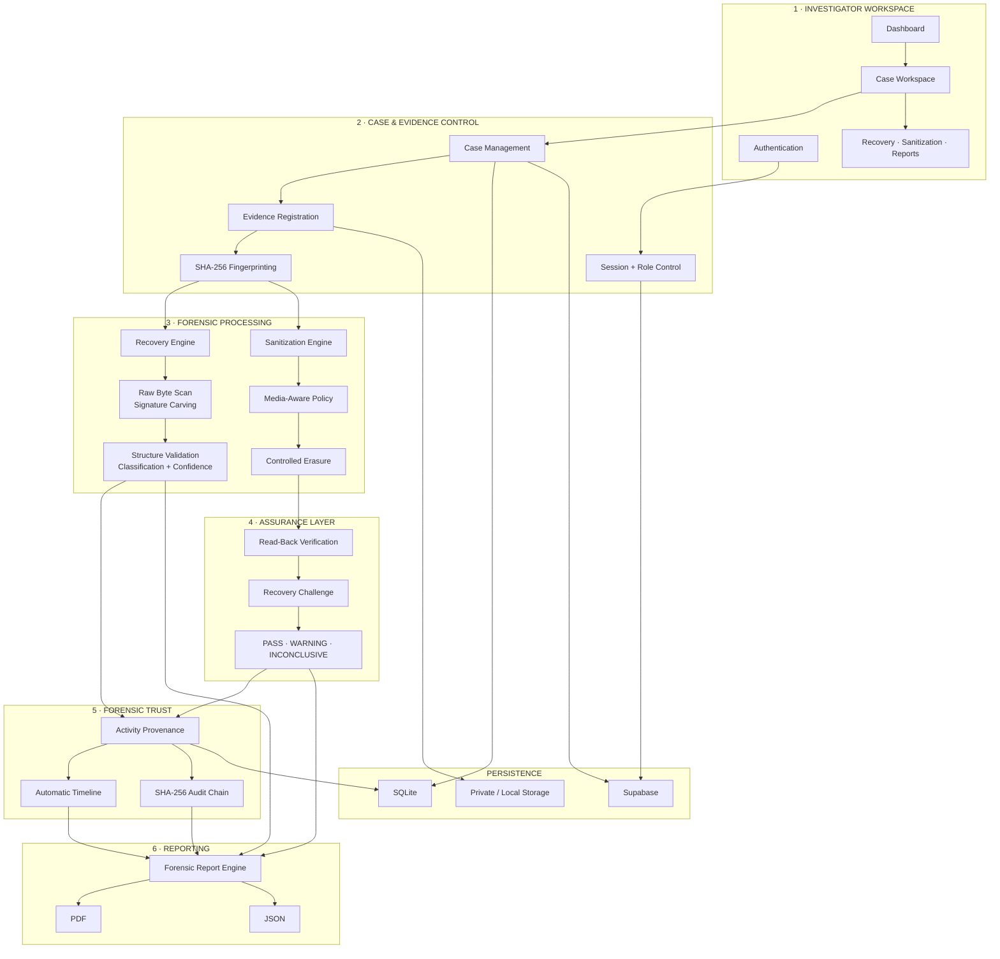
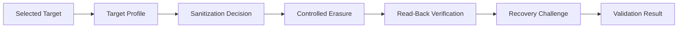
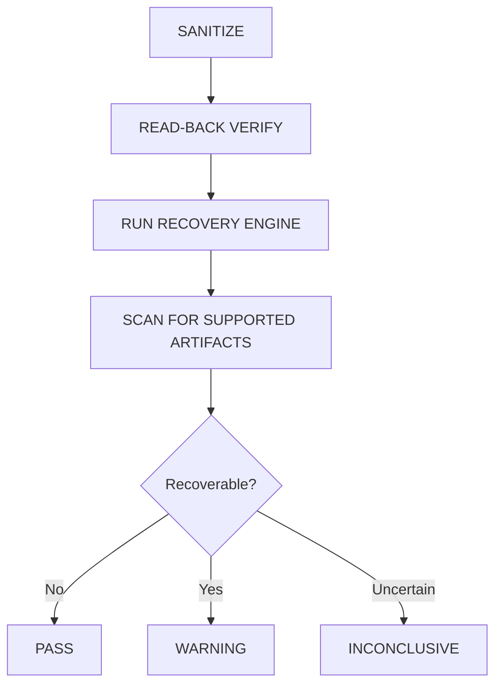
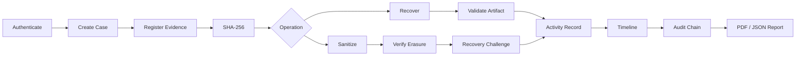

<div align="center">

# RE:TRACE

### Integrated Secure Data Erasure + Advanced File Recovery

**Smart India Hackathon 2026 · Problem Statement SIH26149 · Team Cryptic Crew**

<br>

[](https://re-trace-phi.vercel.app/)


<br>

> **Recover what matters. Erase what must never return. Verify both with trusted proof.**

</div>

---

## Overview

**RE:TRACE** is a case-based digital-forensics and secure-media assurance platform that brings **file recovery, controlled data sanitization, independent verification, activity provenance, tamper-evident auditing, and forensic reporting** into one workflow.

Most utilities concentrate on either:

```text
RECOVERY
```

or

```text
SANITIZATION
```

RE:TRACE connects both operations through an assurance layer:

```text
RECOVER  →  VERIFY  →  TRACE  →  AUDIT  →  REPORT
   ▲                                       ▲
   │                                       │
   └────────────── SANITIZE ───────────────┘
```

### Live Prototype

**[Open RE:TRACE →](https://re-trace-phi.vercel.app/)**

> The hosted prototype safely performs destructive operations only on controlled files, generated test media, and disposable working copies.

---

# System Architecture



### Architecture in One Line

```text
USER
 ↓
CASE
 ↓
EVIDENCE
 ↓
HASH
 ↓
RECOVER / SANITIZE
 ↓
VERIFY
 ↓
TRACE
 ↓
AUDIT
 ↓
REPORT
```

---

# Core Modules

## 1. Case & Evidence Management

Every forensic operation belongs to a case.


A case can maintain:

- Case ID
- Investigator
- Status
- Evidence sources
- Forensic operations
- Timeline
- Audit records
- Reports

---

## 2. Advanced File Recovery

RE:TRACE can inspect raw forensic/test images without relying only on normal filesystem metadata.


### Current Recovery Formats

| Type | Format |
|---|---|
| Image | JPEG |
| Image | PNG |
| Document | PDF |
| Archive | ZIP |

### Recovery Confidence

RE:TRACE does not treat every detected signature as valid evidence.

It evaluates:

- expected header;
- expected footer where applicable;
- plausible file boundaries;
- structural validity;
- readability;
- format consistency.

---

## 3. Secure Sanitization

RE:TRACE provides controlled sanitization for files, folders, and disposable working copies.



The sanitization decision can consider:

```text
Media Type
    +
Operation Scope
    +
Purpose
    +
Data Sensitivity
```

---

## 4. Independent Sanitization Verification

A successful erase operation is **not automatically accepted as proof**.

RE:TRACE challenges the result using the recovery engine.



| Result | Meaning |
|---|---|
| **PASS** | No supported recoverable artifact detected |
| **WARNING** | Supported artifact remains recoverable |
| **INCONCLUSIVE** | Validation could not determine a reliable result |

> PASS refers to the supported validation checks and does not claim absolute physical irrecoverability.

---

## 5. Activity Provenance & Timeline

Important actions are automatically linked to investigation context.

```text
USER
 +
ROLE
 +
SESSION
 +
CASE
 +
SOURCE
 +
OPERATION
 +
TIMESTAMP
 +
RESULT
```

These records are converted into a chronological case timeline.

Example:

```text
09:31:08  Investigator authenticated
09:31:19  CASE-001 opened
09:32:05  Evidence source registered
09:32:06  SHA-256 generated
09:33:14  Recovery started
09:37:41  Recovery completed
09:38:12  Artifact hashes generated
09:39:02  Report generated
```

---

## 6. Tamper-Evident Audit Chain

Audit events are linked through SHA-256.


If a historical event is changed:

```text
Stored Hash
     ≠
Recalculated Hash
     ↓
AUDIT INTEGRITY FAILURE
```

This provides **tamper evidence** instead of maintaining only ordinary application logs.

---

# End-to-End Workflow



---

# Key Features

### Case-Based Investigation

Evidence, operations, users, timeline events, and reports remain connected to a specific case.

### Raw File Carving

Scans raw bytes for supported file signatures and extracts candidate evidence.

### Explainable Recovery Confidence

Uses structural checks rather than relying on signature detection alone.

### SHA-256 Evidence Integrity

Creates fingerprints for evidence and important forensic outputs.

### Controlled Sanitization

Supports file/folder sanitization and disposable working-copy workflows.

### Recovery-Based Verification

Attempts recovery again after sanitization to challenge the erase result.

### Activity Provenance

Records who performed an action, on which case and source, and when.

### Automatic Timeline

Turns application activity into a chronological forensic record.

### Tamper-Evident Audit

Links events using SHA-256 hash chaining.

### Forensic Reporting

Produces structured PDF and JSON outputs.

---

# Technical Stack

| Layer | Technology | Purpose |
|---|---|---|
| Frontend | React | Investigator interface |
| Language | TypeScript | Type-safe frontend |
| Build | Vite | Frontend tooling |
| Backend | Python | Forensic processing |
| API | FastAPI | Application API |
| Local Database | SQLite | Local metadata |
| Cloud Database | Supabase PostgreSQL | Cloud persistence |
| Authentication | Supabase Auth | Identity management |
| Authorization | RBAC + RLS | Access control |
| Storage | Supabase Storage | Private object storage |
| Integrity | SHA-256 | Evidence and audit hashing |
| Deployment | Vercel | Hosted prototype |

---

# Platform

## Landing Page


---

## Investigator Dashboard


---

## Secure File & Folder Erasure

### Input


### Result


---

## Advanced File Recovery

### Input


### Recovered Evidence


---

## Forensic Report


---

# Reproducible Demo Dataset

RE:TRACE includes a deterministic test image with known ground truth.

| Artifact | Count |
|---|---:|
| JPEG | 3 |
| PNG | 2 |
| PDF | 2 |
| ZIP | 1 |
| **Total** | **8** |

This allows repeatable evaluation:

```text
Known Dataset
     ↓
Run Recovery
     ↓
Compare Expected vs Recovered
     ↓
Validate Result
```

---

# Project Structure

```text
Re-Trace/
│
├── backend/
│   ├── app/
│   │   ├── auth.py
│   │   ├── engines.py
│   │   ├── main.py
│   │   ├── native_adapter.py
│   │   ├── reports.py
│   │   └── store.py
│   │
│   └── tests/
│
├── frontend/
│   └── src/
│
├── docs/
│
├── screenshots/
│
├── scripts/
│
└── README.md
```

---

# Important Components

| Component | Responsibility |
|---|---|
| `auth.py` | Authentication and sessions |
| `engines.py` | Recovery, sanitization and validation |
| `main.py` | FastAPI routes |
| `store.py` | Cases, timeline and audit records |
| `reports.py` | PDF / JSON reports |
| `native_adapter.py` | Native integration abstraction |
| `frontend/src/` | User interface |

---

# Quick Start

## Requirements

- Python 3.12
- Node.js 22.12+
- Git

### 1. Clone

```bash
git clone https://github.com/Yemireddy-Pragnavi/Re-Trace.git
cd Re-Trace
```

### 2. Create Python Environment

```powershell
py -3.12 -m venv .venv
```

### 3. Install Backend Dependencies

```powershell
.\.venv\Scripts\python.exe -m pip install -r backend\requirements.txt
```

### 4. Configure Environment

```powershell
Copy-Item backend\.env.example backend\.env
```

Configure the required values inside:

```text
backend/.env
```

### 5. Start Backend

```powershell
cd backend

..\.venv\Scripts\python.exe -m uvicorn app.main:app --host 127.0.0.1 --port 8000
```

API:

```text
http://127.0.0.1:8000
```

FastAPI Docs:

```text
http://127.0.0.1:8000/docs
```

### 6. Start Frontend

Open another terminal:

```powershell
cd frontend

npm ci

npm run dev
```

Frontend:

```text
http://localhost:5173
```

---

# Evaluation Demo

A complete RE:TRACE demonstration can be performed in a few steps:

```text
1. Authenticate
       ↓
2. Create Case
       ↓
3. Register Evidence
       ↓
4. Generate SHA-256
       ↓
5. Recover Evidence
       ↓
6. Review Validation + Confidence
       ↓
7. Sanitize Disposable Copy
       ↓
8. Perform Read-Back Verification
       ↓
9. Run Recovery Challenge
       ↓
10. Review Timeline + Audit Chain
       ↓
11. Generate Final Report
```

---

# Standards & Technical Guidance

RE:TRACE references established guidance including:

| Reference | Purpose |
|---|---|
| **NIST SP 800-88 Rev. 2** | Media sanitization guidance |
| **IEEE 2883** | Storage sanitization guidance |
| **Digital Evidence Integrity Principles** | Evidence preservation |
| **Chain-of-Custody Principles** | Investigation accountability |
| **DoD 5220.22-M** | Legacy overwrite reference |

> These are engineering references. RE:TRACE does not claim formal certification or independently validated compliance.

---

# Implementation Status

| Capability | Status |
|---|:---:|
| Authentication | ✅ |
| Role-Based Access | ✅ |
| Case Management | ✅ |
| Evidence Registration | ✅ |
| SHA-256 Fingerprinting | ✅ |
| Raw Image Processing | ✅ |
| JPEG Recovery | ✅ |
| PNG Recovery | ✅ |
| PDF Recovery | ✅ |
| ZIP Recovery | ✅ |
| Structure Validation | ✅ |
| Recovery Confidence | ✅ |
| File / Folder Erasure | ✅ |
| Working-Copy Sanitization | ✅ |
| Sanitization Verification | ✅ |
| Recovery Challenge | ✅ |
| Activity Provenance | ✅ |
| Automatic Timeline | ✅ |
| SHA-256 Audit Chain | ✅ |
| PDF / JSON Reporting | ✅ |
| Direct Physical HDD / SSD / NVMe Operations | Not exposed in hosted prototype |

---

# Security & Integrity

- Recovery processing preserves the original source where applicable.
- SHA-256 fingerprints help verify evidence integrity.
- Hosted destructive operations are restricted to controlled data and working copies.
- Role-based controls restrict access to investigation functionality.
- Important application events are linked to their case and user.
- Audit hash chaining helps detect unexpected historical modification.
- Secrets and production credentials must never be committed to the repository.

---

# Prototype Boundary

RE:TRACE is currently a **Smart India Hackathon prototype**, not a certified commercial forensic product.

The hosted deployment intentionally does not execute direct destructive ATA or NVMe commands against a visitor's physical storage device.

Physical-device operations require a controlled privileged local environment rather than a normal browser deployment.

---

# Team

<div align="center">

## Cryptic Crew

### Smart India Hackathon 2026

**Problem Statement ID: `SIH26149`**

<br>

### RE:TRACE

**Recover what matters.**  
**Erase what must never return.**  
**Verify with trusted proof.**

<br>

### [Live Prototype](https://re-trace-phi.vercel.app/) · [GitHub Repository](https://github.com/Yemireddy-Pragnavi/Re-Trace)

</div>
