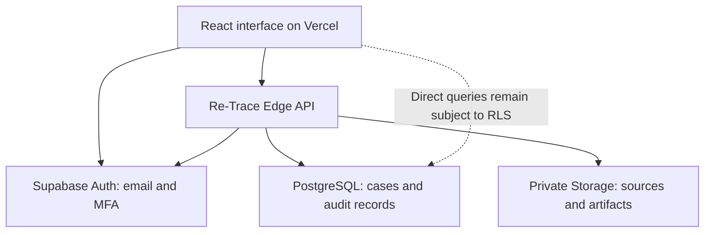

# Re-Trace — Architecture

The current product is a React interface with two backend modes. The deployed cloud mode uses Supabase. A separate Python/SQLite mode supports local development. They share the product workflow, but their security and storage guarantees are not interchangeable.

Reviewed against repository commit `b1825fa` on 29 September 2026. This describes code and recorded verification, not a new live deployment audit.

## Cloud path

The frontend sends the authenticated session token to `retrace-api`. The handler validates the user, checks the active server session and evaluates account/domain approval and MFA before allowing workspace operations. Authorization uses server-managed profiles, not user-editable metadata. Restrictive database policies provide a second boundary for direct data access. Storage objects are served through authorized API paths.

## Where the implementation lives

| Responsibility | Source |
|---|---|
| Landing page and public explanation | `frontend/src/Landing.tsx`, `frontend/src/landing.css` |
| Institutional sign-in, MFA and email-only access request | `frontend/src/AccessGate.tsx` |
| Administrator oversight | `frontend/src/Admin.tsx` |
| Case workspace, module screens and results | `frontend/src/main.tsx` |
| API routing, session headers and downloads | `frontend/src/api.ts` |
| Cloud authorization and workflow orchestration | `supabase/functions/retrace-api/index.ts` |
| Cloud carving, fixture and report generation | `supabase/functions/retrace-api/engines.ts` |
| Database policies and controlled administration | `supabase/migrations/` |
| Local API, authentication, engines and reporting | `backend/app/` |
| Future native-agent boundary | `backend/app/native_adapter.py` — interface only |

The frontend uses React 19, TypeScript, Vite 7, Tailwind CSS 4 and Lucide icons. Cloud processing runs in a TypeScript/Deno Edge Function. Local processing uses Python 3.12, FastAPI, SQLite, Pillow, pypdf, ReportLab and cryptography. These are deterministic processing workflows; no trained AI model or blockchain is part of the implemented recovery engine.

## Source-to-report data flow

1. The authorized operator opens a case and adds files or a raw image. The API records its size, hash and declared media profile.
2. Recovery scans signatures and validates structure before storing each recovered artifact separately. Sanitization creates and processes a disposable copy.
3. Results include relevant integrity checks, rejected candidates, confidence reasons, duration and throughput. The source is rechecked for modification.
4. Server-recorded events construct a chronological case history. Domain/account changes are recorded with before/after values in the audit chain.
5. Reporting assembles case data into a PDF and signed JSON. The JSON includes the PDF hash and an Ed25519 signature. Download paths recheck recovered-file integrity.

## Persistence and trust boundaries

`profiles`, `cases` and `case_members` represent operators and authorization. `evidence_sources`, `jobs`, `recovered_files` and `reports` hold case records. `audit_events` holds hash-linked events. `allowed_domains` holds exact domain decisions. Signing keys are stored in a private schema with restricted access.

Sources and recovered files use the private `retrace-evidence` bucket; report objects use `retrace-reports`. Public frontend configuration may contain the publishable key. Service-role keys and private signing material must never reach frontend code, logs or this documentation.

Key API groups include `/auth/access-status`, `/auth/me`, `/cases`, case-scoped `/jobs`, `/benchmark`, `/timeline`, `/reports`, plus `/admin/overview`, `/admin/events`, `/admin/domains` and `/admin/users`. Local API paths use an `/api` prefix. Read handler code before changing an endpoint contract.

## Execution limits and known gaps

Cloud input is limited to 8 MiB per operation batch, up to ten selected sources, with a 64 MiB per-case source quota. Parser and candidate limits further bound processing. Jobs execute synchronously; there is no durable worker queue, interruption recovery or guaranteed cleanup after runtime termination. Saved RUNNING status is not a heartbeat.

The local backend uses SQLite and local private files. Its local account/session model is not the cloud domain/MFA model. Do not expose it as an institutional production service without a separate security design.

## Deployment and future evolution

Vercel serves the built `frontend` app; the existing Supabase project supplies the cloud backend. Production defaults to cloud mode unless explicitly overridden. `frontend/vercel.json` preserves SPA routes. See [deployment instructions](docs/VERCEL-DEPLOYMENT.md).

A future physical-device release would introduce a privileged local agent with explicit device selection, capability checks, write protection for evidence and command-result verification. Fragment reconstruction, parser isolation, durable jobs and external audit anchoring require their own designs and test evidence. They are not hidden capabilities of today’s browser interface.
